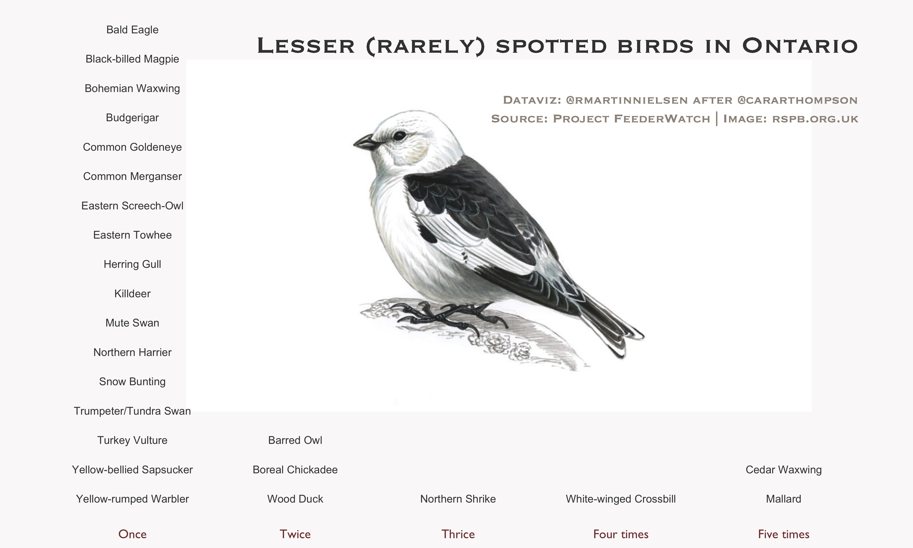
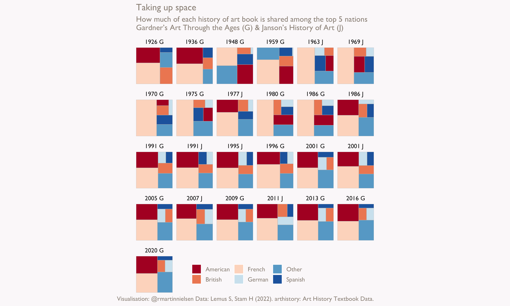
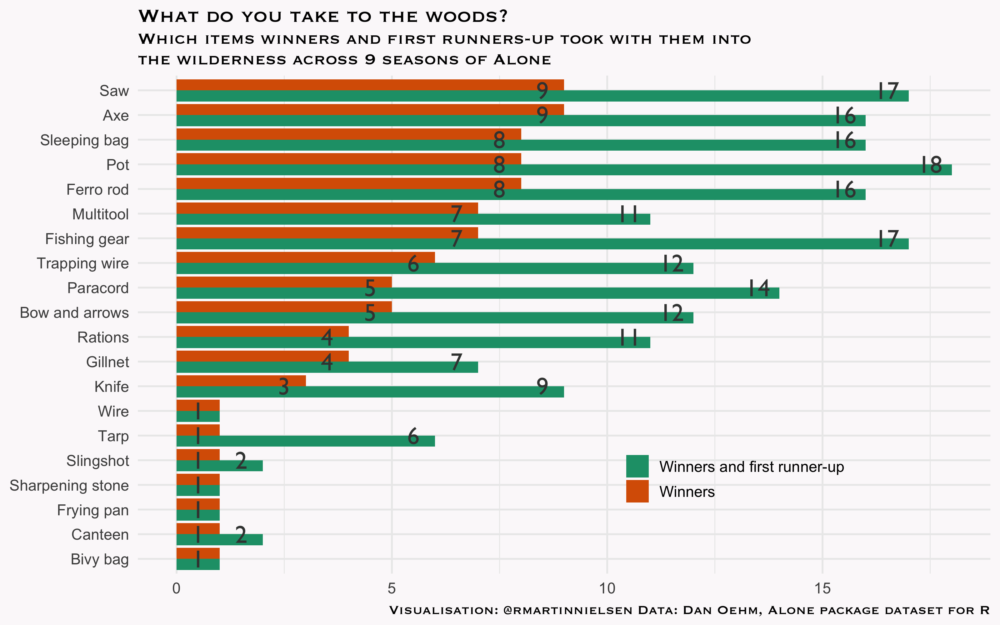

This repo is intended to pull together my occasional attempts at [TidyTuesday](https://github.com/rfordatascience/tidytuesday) exercises.

## 2023-01-10

My first is for 10 January 2023, inspired by spending a lot of time playing Wingspan and by Cara Thompson's much cleaner chart. But I looked at it earlier this week and figured, "I think I know how to do that."

## 2023-01-17

This is not such a clear chart but brings a touch of visual. The [arthistory data package](https://saralemus7.github.io/arthistory/) presents data on how much space individual artists get in art history books from 1926 to 2020. There is a lot more detail and many more stories to be told but I wanted to quickly look at nationalities - how much "space" each of the top five take up.

## 2023-01-24

This week we are working with data from Dan Oehm's [alone](https://github.com/doehm/alone) data package for R. I had not heard of the show before seeing this data package. I like some of what Oehm already presents. I was curious to look at whether great minds might think alike - what are the items which all the winners took with them? What about first runners-up?

This could be tidier. It would be interesting to compare with how prevalent these items are across all contestants. My palette choice needs work. I fiddled with fonts but am not quite happy with it. Still, this makes the initial question somewhat accessible.

